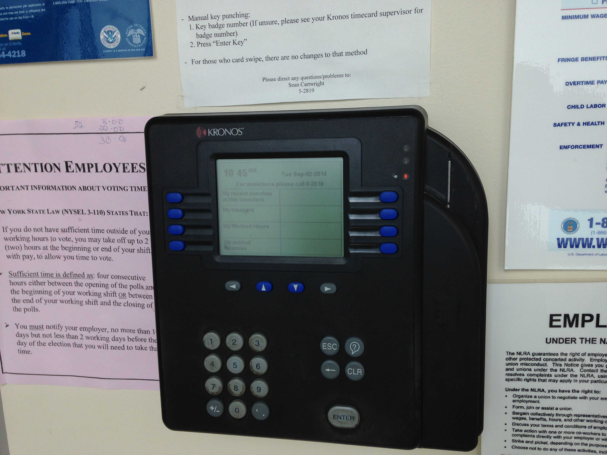

# Data Integrity and Locking

## Data Integrity
- A system that produces predictable and reproducible results
  leads to data integrity
- A goal of any DB system is to have data integrity

## Data Concurrency
- Many users can access the same data at the same time
    - Typical for multi-user systems

## Data Consistency
- Each user sees a consistent view of the data
    - Including changes made by transactions of others and self

## Transaction Isolation Model - Serializable
- Transaction Isolation $\Rightarrow$ ONE transaction happens at a time
- Created by the need for ‘consistent transaction behavior’
    - Data concurrency and data consistency 
- The Model – “Only ONE transaction happens at a time”
    - Perfect way to ensure data integrity
    - Decreases performance
    - Not practical for most multi-user systems

## Lock
- The mechanism used to enforce Transaction Isolation

## Types of Locks
- Write Lock (or Exclusive Lock)
    - One user holds the lock
    - Commit or Rollback releases the lock
    - Contention – the interference caused by conflicting locks
        - Contention increases $\Rightarrow$ response time decreases
        - (kind of like 100 people at a party and only one
	toilet in the house – there will be contention for
	that toilet behind a locked door)
- Read Lock (or Shared Lock)
    - Many can read at the same time
        - Analogous to teacher saying: I’ll wait for
	everyone to read this before I change it

## Transaction Isolation Problems
The following problems were described by the ANSI standards committee in the development of SQL standards.
 @Berenson1995 showed that these transaction isolation problems are only a subset of the practical problems.
Wikipedia has a comprehensive article on this subject, called *Isolation (database systems)*.

We can easily conceive of three kinds of transaction isolation problems, writes followed by reads (dirty reads), reads followed by writes (nonrepeatable reads) and writes followed by writes (lost updates).

## Problem---Dirty Reads
Dirty reads can be explained by considering two transactions. The first transaction writes but does not commit. The second transaction reads during this temporary modified state and sees a state that will only exist in case of a commit. Then the first transaction rolls back. The database is in no way harmed but the second transaction may have led to an external action based on a fallacious assumption.

Shopping provides an analogy to dirty reads. A store has the quantity of item you need (per online inventory). Yet you can not find the item because a customer is walking around the store with the items in a basket (but does not eventually purchase them) or the items are on a ‘returns’ shelf. In either case, the store may have suffered a lost sale but this is based on behavior external to the merchandise inventory or database. There is never erroneous information in the system.

Some products allow dirty reads due to performance issues. Transactions are faster overall if fewer read restrictions are in place. In many situations, reads are vastly more common than writes.

## Problem---NonRepeatable Reads
Consider two transactions where the first transaction reads and then the second transaction writes, changing what was read by the first transaction. Now the first transaction reads again and receives results conflicting with the previous result. This occurs because either a read lock was not acquired at all or was released between queries within a transaction.

Any transaction that needs to perform the same read twice may be subject to this anomaly. As with the previous issue, the database is not harmed but a procedure that does not take this possibility into account may behave unpredictably.

## Problem---Phantom Reads
This is a special case of nonrepeatable reads. Here a different set of rows is returned the second time the first query reads. This is caused by the failure of either query to acquire a range lock on the rows indicated by the query. A range lock may be more specific than a read lock, since a read lock may refer to an entire table.

## Problem---Lost Updates
Suppose items A and B must be sold for the same price: if one goes on sale or is subject to a price increase the other must be treated likewise. Transaction P sets both prices to 1 and transaction Q sets both prices to 2. There are a total of four write operations between the two transactions. If the transactions are interleaved, then A and B may wind up with different prices.

## Isolation Levels
- Serializable – the “perfect” solution to Data Integrity Issues
    - Very difficult to do in the real world
    - Degrades performance
- Repeatable Reads
    - Keeps read and write locks
    - Phantom reads will still occur
- Read Committed
    - Keeps read and write locks
    - Releases write lock for SELECT transactions
    - Phantom reads will occur
- Read Uncommitted
    - Lowest level of transaction isolation
    - Dirty Reads may occur

## Concurrency control is sometimes an issue
- In any database application with 2 or more
simultaneous users.
- If a system is only used by one user at a time, it
does not have concurrency issues.

- Transaction database systems do not all suffer from
concurrency control.

- Different DBMS software handles concurrency issues
differently.

- (Transaction posting and resource locking)

## Concurrency control
- Concurrent user systems must offer atomic transactions.
- Transaction integrity requires that either the entire
transaction posts or none at all.
- SQL commands exist to support transaction integrity.
    - COMMIT---saves transaction
    - ROLLBACK---undoes all SQL since the last COMMIT command was executed

## Problem 1
If two transactions are posted at the exact
same time and one is rolled back, then so is the other
transaction.

## Solution
Transaction Serialization---entire
transaction is given a unique identifier.

## Problem 2
If two users are updating the same record at
the same time, one user's changes will be lost.

## Solution
- Resource Locking---when a record is
  being updated, no other user can update it.
- *Exclusive* Lock---lock the record and do not allow
  any reading of the record until it is saved.
- *Shared* Lock---lock the record and allow reading of
  the record while it is being updated.

## Problems with each approach
- Exclusive---what if someone leaves an updating record
  open while they go to lunch?
- Shared---what if someone opens a currently editing
  record and doesn't see the change?

## Deadlock Example
Two transactions post at the same time, one transaction
has the inventory table open for posting and needs the
sales tax ledger while the other transaction has the sales
tax ledger open and needs the inventory table. Neither
will let go.  The result is called deadlock.

## Approaches to record locking
- Optimistic - no conflict will occur
    - Transaction is posted, then the system checks for
   conflicts; if they existed a ROLLBACK is issued and the
   system tries again
- Pessimistic - conflicts are going to occur
    - Locks are issued, the transaction is posted, locks are
   released
- Which has the highest overhead? Here
overhead means the most CPU processing time.
- Depends on actual business environment
- Purchasing on amazon.com vs purchasing on Western
  Plumbing Supplies

## Granularity of record locking
- Table, Page, Record, Field
- What are some of the advantages and disadvantages?
- Table level is coarse grained, field and record are fine-grained
- Finer grained the locking level, the higher the overhead (processing lag)
- Finer grained the locking level, the more likely users will not
  have to wait for resources

## Avoiding most locking
Although some modern databases such as Oracle feature locking, most locking isn't strictly needed by databases (including Oracle) implementing multiversion concurrency control.
The following notes come from an excellent blog post by
[brandur](https://brandur.org/postgres-atomicity).

## Multiversion concurrency control
Statements execute inside a transaction with boundaries and create multiple new versions of data instead of overwriting it. The new versions of data are hidden until the transaction commits and any reading transactions see the previous version via a *snapshot* of the database at the time the writing transaction begins. PostgreSQL implements a process called Vacuum to periodically remove the hidden rows that are no longer valid after the transaction commits.

PostgreSQL uses a write-ahead log to achieve durability in the face of crashes or power losses. All changes are written and flushed to disk so that in the event of sudden termination, PostgreSQL can replay the write-ahead log to recover changes that didn't make it into the database.

In addition to the write-ahead log, there is also a commit log, which forms the ground truth of commit status. It records only two bits besides the id of each transaction. Those two bits record four possible states: in progress, committed, aborted, and sub-committed.

## Performance considerations
The preceding is an oversimplification of the process described in brandur's blog post. For performance reasons, there are a lot of additional features. In particular, PostgreSQL skips a lot of steps for some transactions if they never try to write. Transactions are still written to the write-ahead log and commit log if they are aborted, but unaffected rows of the database have snapshots that are never consulted because of the aborted flags in the logs.

## Subcommitting
A transaction may have a parent row and several subcommitted rows. Each subcommitted row must be committed before the parent is committed and the database may crash after every subcommit and before the parent commit, so these need to be recorded separately.

## Some locking is still required
A process that commits acquires a lock on the last process ID completed to avoid negation of its work.

## Database errors can't all be fixed
- Human errors (new users not trained completely)
- Computer crashes
- Software bugs

## Overheard at the timeclock
*One thing to remember is even if you format it wrong it will accept it for some reason so be careful ...*

There is a timeclock between Building 70 and the next building (Service Center?) which collects information for the payroll database. Evidently the system has some eccentricities requiring employees to exercise caution in data entry. I'm not sure what happens but it seems plausible that you can make a mistake and instead of rejecting your input, the system simply ensures that you don't get paid without going through additional steps.

## Recovery
Recovering the database takes different forms based on
the state of the database when it crashed and the time
the system was down.

- Reprocessing (manually) the missing records since last
  backup
- Change log can be processed; a new change log is
  stared following each backup

- Roll forward - restore the backup and apply each
  record in the change log
- Rollback - start with the condition at time of failure
  and undo transactions not completed

## Log size
Change logs require before and after images. If a table has 15
fields, its change log has at least 30 fields.

## Log policies
Log policies include permissions for viewing logs, safeguards to ensure that logs are free from tampering, and policies for keeping and disposing of logs, including the length of time logs are kept, sizes of logs kept, and method and timing of disposal. A key issue in log policies is that managers and database administrators must work together to establish and enforce policies because each may have important knowledge the other lacks. For example, external regulatory bodies may mandate that logs be kept for a "reasonable" period of time but not define what reasonable means. Both knowledge of the business and knowledge of technical details must come together to define reasonable in this case.

## Two related roles
- Data Administration (DA) vs Database Administration (DBA)
- Responsibilities
    - Data Administration (DA) - Overall management of an
      organization's data resources
    - Database Administrator (DBA) - Physical database design,
      security, performance

## Two different profiles
- DA (data administrator) is a middle to high-level manager; varied
  organizational experiences
- DBA (database administrator) technical, optionally low-level manager;
  hardware and software experience

## Reasons profiles differ between DAs & DBAs (DA)
- DA must understand how all organizations use the data
  differently (many years with company)
- DA needs the authority to make changes and policy
- DA needs to work with upper management to understand
  long-term goals
- DA needs database design experience and business
  decision-making experience
- DA position is NEVER outsourced or given to a new hire

## Reasons profiles differ between DAs & DBAs (DBA)
- DBA must understand the computing world: software,
hardware, performance issues
- They need database implementation experience
- This position should not be outsourced but it can be
given to a new hire

## Divide these tasks between DAs and DBAs (Q)
- Some tasks might be a combination of DA and DBA
- Establishing data policies, procedures and standards
- Identifying database architecture (FAT Client/FAT Server)
- Establishing backup and recovery plans
- Maintaining data security and integrity
- Selection of database hardware and software
- Designing the data storage/repository
- Identifying shared data and data privileges
- Logical database design
- Physical database design
- Planning database growth and change

## Divide these tasks between DAs and DBAs (A)
- Some tasks might be a combination of DA and DBA
- Establishing data policies, procedures and standards - (\DA)
- Identifying database architecture (FAT Client/FAT Server) - (\DBA)
- Establishing backup and recovery plans - (\DBA)
- Maintaining data security and integrity - (\DA/\DBA)
- Selection of database hardware and software - (\DBA)
- Designing the data storage/repository - (\DA/\DBA)
- Identifying shared data and data privileges - (\DA)
- Logical database design - (\DA/\DBA)
- Physical database design - (\DBA)
- Planning database growth and change - (\DA/\DBA)

## How a DA can manage data security
There is a *laundry list approach* to security where the data administrator simply reacts to external requirements and fulfills them one at a time as they arise. In this approach, the data administrator does not form mental models of how these items may relate to each other and simply considers them one at a time. Forming a mental model is irrelevant for attacks by *script kiddies*, a name used to refer to adversaries who make uncoordinated attacks on assets. On the other hand, considering the following tools piecemeal may make the system more vulnerable to purposeful adversaries.

    - passwords
    - authorization rules
    - hardware firewalls
    - encryption
    - backups
    - views

Later, when we discuss authentication and authorization, we'll discuss another approach to security that may be warranted if management agrees that coordinated effort is worthwhile.

