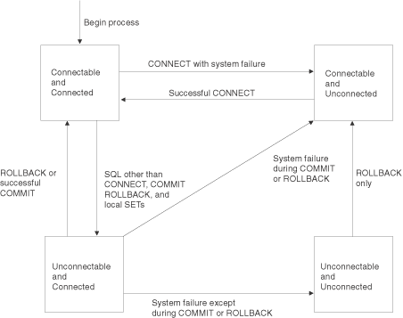
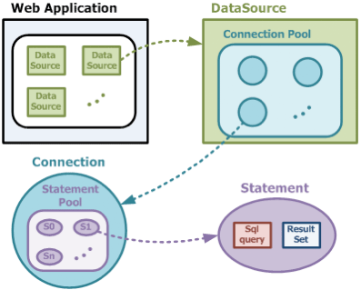

# Performance and Refactoring

<style type="text/css">
h1,h2,h3 {
  font-family: Arial, Helvetica, sans-serif;
}
h1 {
  font-size: 18px;
  font-weight: bold;
  font-variant: small-caps;
  text-align: center;
  letter-spacing: 3px;
}
h2 {
  font-size: 15px;
}
h3 {
  font-size: 12px;
  font-style: italic;
} </style>

## How performance can be improved
One way to think about performance improvement is to think about the functional areas affecting database performance. These areas include database connections, transactions, sql statements, and data retrieval.

Another way to think about performance improvement is to categorize the ways to improve performance. Every performance improvement can be classified as reducing network traffic, limiting disk i/o, optimizing interaction between the driver and application, or improving queries.

## Database connections
Database connections may be created one at a time or pooled for reuse. Connections are expensive, requiring memory and multiple round trips to the database server to establish. Opening numerous connections takes a significant amount of memory and time. Reusing connections may save significant time and memory if numerous connections materialize.
Managing connections requires establishing connection pools, an arcane activity requiring either expertise or the use of third party connection management tools.

## Connection pools
A connection pool is a cache of physical database connections available for reuse by one or more applications. A connection pool can help in a situation where an application on a server has multiple users. The database server must have adequate memory and, possibly, licenses to support the maximum connections specified by the connection pool. Connections should be opened just before use, then closed immediately after use and returned to the connection pool.

Connection pools are not indicated in the case of applications without an application server, applications that restart frequently each day, single-user applications like report writers, or periodic jobs such as logging and reporting. Background jobs run at non-peak times typically do not benefit from connection pools.

## Ideas about connection management

Many SQL Server blogs endorse third party connection management tools
  (e.g., Idera) or consulting services due to the complexity of setting connection pooling parameters.

[Csharp connection management](http://stackoverflow.com/questions/7475200/sql-server-connection-management-with-c-sharp)
  reports an argument where one side claims that db connections should be
  opened and closed by the same method! The other claims that this should be
  analyzed for performance gains.

[Ensure Proper SQL ...](http://blog.idera.com/sql-server/performance-and-monitoring/ensure-proper-sql-server-connection-pooling-2/)
  suggests profiling application servers and offers a diagnostic SQL
  statement the author uses to begin investigating the possibility of
  connection pooling issues



[DB2 Remote Connection Mgt](http://www-01.ibm.com/support/knowledgecenter/SSEPEK_11.0.0/com.ibm.db2z11.doc.sqlref/src/tpc/db2z_remoteconnectionmanagement.dita)
posits four possible states and points out that a connect should be preceded
by a commit or rollback and will fail if preceded by any sql statement other
than connect, commit, release, rollback or set connection.

## DBMS-specific connection management issues
More traffic may be found online about SQL Server connection management than for other dbms.
Does that reflect popularity? Or could there be a more complicated dynamic at work. There are many measures of popularity. Job listings are one example.

## Statement pooling means statement caching

A given DBA may use either expression, statement pooling or caching.

[Statement pooling in JDBC](http://www.cubrid.org/blog/dev-platform/how-statement-pooling-in-jdbc-affects-garbage-collection/)
by Dongsoon Choi, argues that caching repeatedly used SQL statements improves application performance.

The improvement arises because of the design of garbage collection in Java.
Garbage collection in Java is predicated on the notion that most objects
  quickly become unreachable and a reference from an old object to a new
  object is rare.
The author's firm requires 300ms response time for web services, so garbage
  collection is too aggressive.

---

Each application has a connection pool.
Each connection has a statement pool. Each statement has a query and a (not cached) result
set.



## Statement pooling may not be optional

- [Apache MyBatis](http://en.wikipedia.org/wiki/MyBatis) exemplifies
  a persistence framework to automate mapping between SQL statements and
  methods in Java (its ancestor, iBatis, also worked with .NET and RoR).
- Statement pooling is not optional in an environment using such a framework.
- All statements are passed as prepared statements.
- Developer controls a setting like `MaxStatements` to express the number of
  SQL statements
- Because of the relationship in the previous diagram, the number of
  statements, not their size, matters.

## Proper size of MaxStatements

- Large numbers of SQL statements requires setting a larger value
  `MaxStatements` (or similar parameter)
- Default in jdbc is 500, likely good for 250KB of queries.
- Choi suggests that 250MB is needed for 10,000 queries and 50 connections,
  for example. (500 bytes per SQL $\times$ 10,000 SQL statements $\times$ 50
  connections)

## SQL Statements
Consider the following source on improving pagination performance in MySQL
[SQL I Love](http://allyouneedisbackend.com/blog/2017/09/24/the-sql-i-love-part-1-scanning-large-table/).

This blog post contrasts three ways of paging results from a 100,000,000 record MySQL database. The first attempt is a complete failure with MySQL failing to return any rows given a `select` statement that attempts to fetch all 100,000,000 rows.

The second attempt uses the `limit` clause of the `select` statement. The `limit` clause can be used with either one or two arguments. If two arguments are given, the first argument is the offset (0 to start with the first row) and the second argument is the "page size" which means the number of rows returned each time the query is issued.

This second attempt has two problems. First, it becomes slower and slower as the offset grows. In the example, the last page takes well over a minute to return. This is because the previous rows are being fetched to find the offset.

The second problem with the second attempt is easiest to see if you run the query in a loop in a program to fetch all rows, a page at a time. In this scenario, another process could delete some records between fetches, so that some records are skipped. For example, suppose the page size is 100 and records 98 and 99 are deleted between the request for the first page and the second page. The 100th and 101st records will be skipped by the second request because they are now part of the first page, although they weren't when the first page was requested.

The third attempt satisfies the blog poster but not all of the commenters to the blog. That solution is to use the `user_id` field to paginate and only use the `limit` clause with a single argument, so that it simply gives a page size rather than an offset and a page size. This turns out to be a thousand times faster for rows farther along in the database than the second attempt because unwanted rows are not being fetched.

Perhaps the most valuable part of the blog post is the use of `explain extended` to analyze the difference between their execution plans. The third attempt has a constant number of rows analyzed, half the number of rows in the table, while the second attempt has analyzes a number of rows based on the size of the offset.

So, is this the right answer for pagination? Many of the commenters on the post disagree. Further, they point to a lot of more sophisticated posts about keyset pagination. For example,
[we need tool support for keyset pagination](http://use-the-index-luke.com/no-offset). This post suggests tracking the `last_seen_id` and using that to paginate. (There appears to be an error on that post where the poster uses a less than sign instead of a greater than sign with `last_seen_id` but the idea is pretty clear.)

## SQL Tuning
The preceding example suggests that it may be worthwhile to study SQL performance from more than one source.
@Tow2003 provides a complete book on SQL tuning and posits three basic steps to the process:

1. Figure out which execution plan (the path to reach the data your SQL statemet demands) you are getting.
2. Change SQL or the database to get a chosen execution plan.
3. Figure out which eecution plan is best.

Tow lists these steps in the above (illogical) order on purpose, claiming it reflects common practice. In its place, he offers the following list of questions to answer:

1. Which execution plan is best, and how can you find it without trial and error?
2. How does the current execution plan differ from teh ideal execution plan, if it does?
3. If the difference between the actual and ideal execution plans is enough to matter, how can you change some combination of the SQL and the database to get close enough to the ideal execution plan for the performance that you need?
4. Does the new execution plan deliver the SQL performance you need and expect?

Tow goes on to claim that the first question in this list is the most important and devotes much of the book to answering it.

## Database performance resources
Database performance in general is the subject of the
[Persona db performance blog](https://www.percona.com/blog/).

## Dice ads for the following search strings

      13,216 Oracle
      12,745 SQL Server
       3,806 MySQL
       1,920 DB2
       1,185 MongoDB
         802 Sybase
         730 PostgreSQL

Note that the above list is old. My impression is that more recently SQL Server has eaten Oracle. Also note that PostgreSQL is by far the most frequently mentioned on Hacker News. That is an example of how different communities have different concerns. People on Hacker News are a small and very specific community. Dice represents all kinds of businesses in different communities.

## Obtaining machine information

An individual project planning to include a section on performance needs to
be able to obtain system information about the target system to figure out
performance parameters. For example, one project in Fall 2014 contemplated
using Gibson, a host at RIT available to students, as an application server
and database server. You can use `ssh` to connect to this system and issue some commands to determine some of its characteristics as follows.

## Kelvin
Kelvin is a server students may use instead of Gibson.

\scriptsize
\begin{verbatim}
[mjmics@kelvin ~]$ uname -a
    Linux kelvin.ist.rit.edu 2.6.32-504.3.3.el6.x86_64 #1 SMP
    Wed Dec 17 01:55:02 UTC 2014 x86_64 x86_64 x86_64 GNU/Linux

[mjmics@kelvin ~]$ df -h
    df: `/root/.gvfs': Permission denied
    Filesystem            Size  Used Avail Use% Mounted on
    /dev/mapper/vg_kelvin-LogVol00
                           32G  6.3G   24G  21% /
    tmpfs                 7.8G   80K  7.8G   1% /dev/shm
    /dev/sda1             976M  146M  780M  16% /boot
    /dev/mapper/vg_kelvin-LogVol02
                          818G   23G  754G   3% /home
    /dev/mapper/vg_kelvin-LogVol01
                          126G   14G  106G  12% /var

[mjmics@kelvin ~]$ whoami
    mjmics

[mjmics@kelvin ~]$ mysql --version
    mysql  Ver 14.14 Distrib 5.1.73, for redhat-linux-gnu (x86_64)
           using readline 5.1

[mjmics@kelvin ~]$ psql --version
    psql (PostgreSQL) 8.4.20
    contains support for command-line editing

[mjmics@kelvin ~]$ mongo --version
    MongoDB shell version: 2.4.14

[mjmics@kelvin ~]$ du -h
    1.9G    ./Sites
    4.0K    ./.mozilla/extensions
    4.0K    ./.mozilla/plugins
    12K     ./.mozilla
    8.0K    ./.gnome2/keyrings
    12K     ./.gnome2
    1.9G    .

[mjmics@kelvin etc]$ cat /etc/centos-release
    CentOS release 6.7 (Final)

[mjmics@kelvin etc]$ cat /etc/filesystems
    ext4
    ext3
    ext2
    nodev proc
    nodev devpts
    iso9660
    vfat
    hfs
    hfsplus

[mjmics@kelvin etc]$ head /etc/init.d/httpd
    #!/bin/bash
    #
    # httpd        Startup script for the Apache HTTP Server
    #
    # chkconfig: - 85 15
    # description: The Apache HTTP Server is an efficient and extensible
    #              server implementing the current HTTP standards.
    # processname: httpd
    # config: /etc/httpd/conf/httpd.conf
    # config: /etc/sysconfig/httpd
\end{verbatim}
\normalsize

## Gibson

(Reports differ about whether the following information is obsolete. Gibson was taken out of service and returned to service. At some point that cycle will end.)

- RIT has a web server named Gibson that can be your application server
- saying `uname -a` reveals it is running SunOS 5.10 on an i86pc
- Googling reveals that 5.10 is equivalent to Solaris 10, but that SunOS is
  a subset of Solaris---just the operating system
- [Oracle documentation](http://docs.oracle.com/cd/E19253-01/817-0403/6mg741bqq/index.html) says
    - to use `showrev` with various options
    - `prtconf` claims that 1GB of memory is installed (??)
    - `prtconf -x` exits silently, indicating 64-bit ready\linebreak firmware
    - `psrinfo -pv` indicates that gibson has an AMD\linebreak Opteron 6274 CPU running
      at 2.2Ghz

- `df -h` indicates 2GB swap space. The other numbers reported by `df` are
  hard to interpret. My guess is that there is a physical 300GB disk with
  5 partitions of 50GB each for user data. Each of these 5 partitions is at
  about 25 percent of capacity. The fact that their usage levels are so
  similar may mean an appliance of some sort is involved but I have no
  further info. Suffice it to say that every user seems to be on a partition
  with about 33GB free.
- `mysql --version` indicates 5.1.62

Note that, for many versions of Linux, distribution info can be found by saying `lsb_release -a` at a terminal prompt. More information about `lsb_release` is available on many distributions by saying `man lsb_release` at a terminal prompt, or by googling *Linux Standard Base*, a joint project of several Linux distributions to improve compatibility between them.

To summarize, you should include a few sentences about system
parameters in your design document based on information you get from
using an approach like this.

## Discuss performance in your project

Some miscellaneous examples of performance issues in past projects include the following hodgepodge.
If you use PHP, for instance, you should say how it works on the server. Servers like Gibson may have to cater to multiple projects and multiple PHP major versions.
If you have a
file within conditional---say whether it will always include or only when you reach a condition.
If response time is an issue, get response time. For example, you can use `curl`.
You may use chrome devtools in the network panel find out time to load.
Maybe use firebug.
Maybe use multiple vms to avoid caching problem.
If using Csharp, may describe background worker like threading.
Don't just worry about size but also number of statements
Check into persistence framework / caching of sql statements.
Server-side pagination? In mysql limit to first n results.

## Other performance tools
You should consider infrastructures tools for performance improvement. Following are some examples.

[Varnish](https://en.wikipedia.org/wiki/Varnish_(software)) is an http accelerator for content-heavy dynamic web sites.

[Squid](https://en.wikipedia.org/wiki/Squid_(software)) is caching and forwarding web proxy.

[Nginx](https://en.wikipedia.org/wiki/Nginx) is a high-performance web server with some additional capabilities, such as load-balancing and http caching.

[Memcached](https://en.wikipedia.org/wiki/Memcached) is a general-purpose distributed memory caching system.

Javascript [minification](https://en.wikipedia.org/wiki/Minification_(programming)) is the process of removing unnecessary characters from Javascript to minimize data transfer. Tools like UglifyJS can handle this.

Design patterns like [lazy loading](https://en.wikipedia.org/wiki/Lazy_loading) may be thought of as performance tools. You can lazy load below-the-fold content to speed up page rendering for instance.

## Refactoring

Refactoring is the act of improving code without changing its external behavior.

Martin Fowler’s *Refactoring, Improving the Design of Existing Code* is the definitive reference.

## Extract a method from a code fragment
Suppose you have a code fragment that makes sense grouped together.

```java
printStuff() {
   printBanner();
// print details
   System.out.println("Name: "   + this.name);
   System.out.println("Amount: " + this.amount);
}
```
may be refactored as
```java
printStuff() {
   printBanner();
   printDetails();
}
printDetails() {
   System.out.println("Name: "   + this.name);
   System.out.println("Amount: " + this.amount);
}
```

## Explain the meaning of a construct
Simplify a complicated fragment so that a casual reader may immediately comprehend the intention.

```java
if ( (platform.toUpperCase().indexOf("MAC") > -1 ) &&
     (platform.toUpperCase().indexOf("IE")  > -1 ) &&
                                  wasInitialized() &&
                                      (resize > 0) ) {
   //do something only under this set of conditions
}
```
may be refactored as
```java
final boolean isMac
     = platform.toUpperCase().indexOf("MAC") > -1;
final boolean isIE
     = platform.toUpperCase().indexOf("IE")  > -1;
final boolean wasResized
     = (resize > 0);
if (isMac && isIE && wasInitialized() && wasResized) {
   //do something only under this set of conditions
}
```

## Simplify a compound condition
The author of this example may have left the rest of the exercise to the reader. It might be worthwhile to add that this refactoring requires some additional methods. It may be the case that, if we wrote those out, we might write them differently. See what you think.

```java
if (date.before(SUMMER_START)||date.after(SUMMER_END))
 charge=quantity*this.winterRate+this.winterServiceCharge;
else
 charge= quantity * this.summerRate;
```
may be refactored as
```java
if (isSummer(date))
    charge = calcSummerCharge(quantity);
else
    charge = calcWinterCharge(quantity);
```
Might it make more sense to write a method to replace the if and the two methods posited above? Or would that contradict some of the examples below? Would it turn out that very little of the code depended on the parameters? It depends on what else is going on in the code. Given the little we see here, there are two rates, one conditional service charge, and two dates defining the two seasons. If that is everything, I would group the rates and service charge into one method, called by\linebreak `calcCharge(date,quantity)` and the dates and season calculation into another method called by `getSeason(date)` from within the other method.

## Replace error code with exception
Note. This is not strictly an example of refactoring because it does change behavior.  It may be that the author of this example was thinking about the idea that neither the code nor the exception are seen 'externally'.  It certainly makes sense to avoid passing error codes.
```java
int withdraw(int amount) {
   if (amount > this.balance)
  return -1;
   else
       this.balance -= amount;
       return 0;
}
```
may be 'refactored' as

```java
void withdraw(int amount) throws BalanceException {
   if (amount > this.balance) throw new BalanceException();
   this.balance -= amount;
}
```

## Pull up a field or method
Suppose that two subclasses have the same field or method.
Move the field or method to the parent class.
Use this approach if the field or method exists in all subclasses.
The field or method may have different names so 
ensure that the meaning is the same in each case.

## Push down a field or method
Suppose the behavior of a parent method or field is relevant for only some of the subclasses.
Move the field or method to the appropriate subclasses

## Extract a superclass
Suppose that two classes have similar features.
Create a superclass and move common features to the superclass.
This approach may lead to using the pull up refactoring approaches mentioned above.

## Extract a subclass
A class has features that are used only in some instances.
Create a subclass for that set of features.
This approach may lead to using the push down refactoring approaches mentioned above.

## Add parameters
Suppose that two methods perform similar operations.
Create a parameter-driven method that accomplishes the tasks of both methods.
The goal is to abstract the operation and drive it with parameters
rather than simply using if statements.

```java
class Employee {
  void tenPercentRaise() {
    this.salary *= 1.1;  
  }
  void fivePercentRaise() {
    this.salary *= 1.05;  
  }
}
```
may be refactored as

```java
  void raise (double factor) {
    this.salary *= (1+factor);
  }
```
